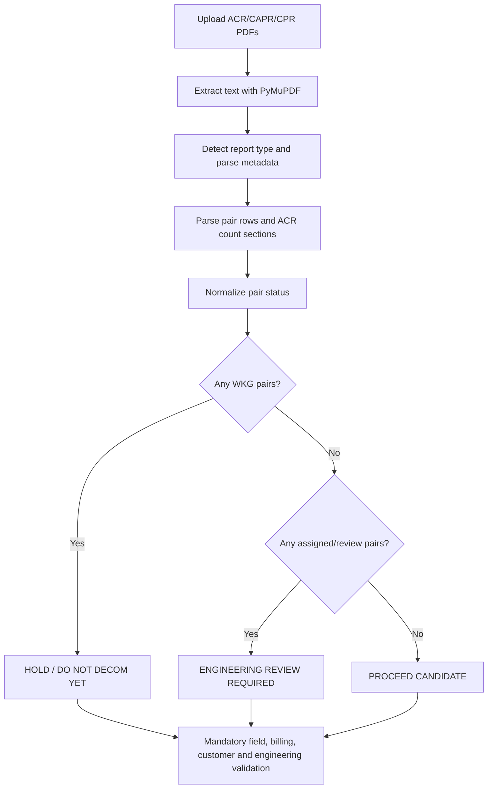
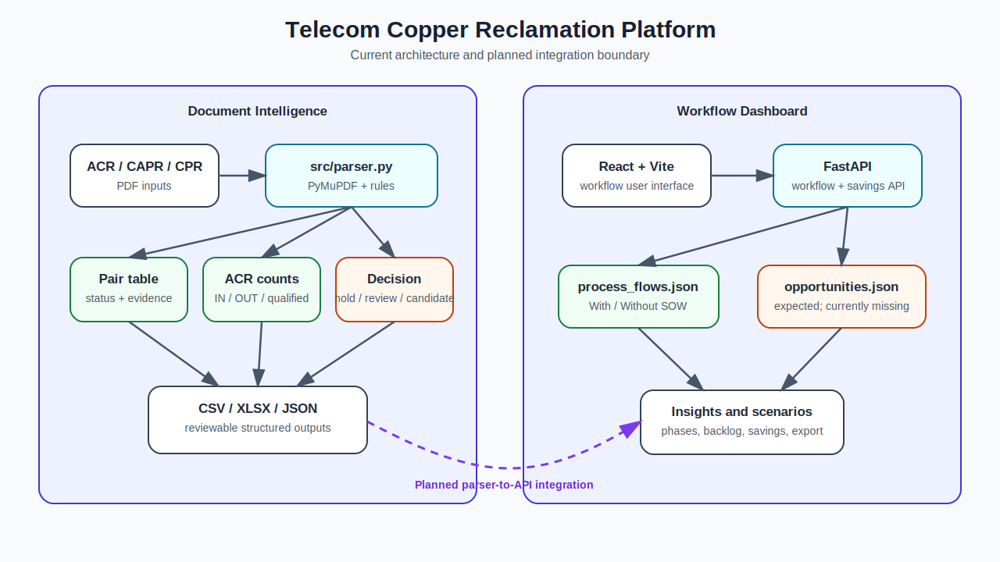
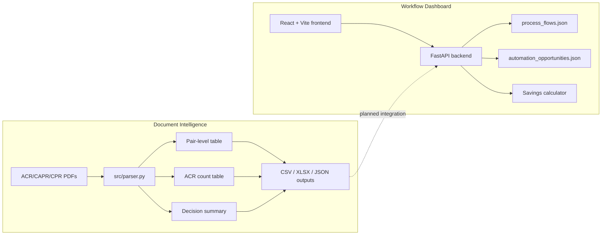

# AI-Powered Telecom Copper Reclamation Workflow Automation Platform

> Decision-support and workflow-automation prototype for telecom copper reclamation, ACR/CAPR/CPR document analysis, pair-status classification, and decommission-planning operations.

[](https://www.python.org/)
[](https://fastapi.tiangolo.com/)
[](https://react.dev/)
[](#current-implementation-status)

## Overview

Telecom copper-reclamation programs require teams to combine information from engineering reports, pair records, planning systems, field observations, design packages, permits, and quality-control checks. Much of this work is repetitive and manually coordinated across PDF reports, spreadsheets, and operational systems.

This repository brings two complementary capabilities into one platform:

1. **Document intelligence and decision support** — parses ACR, CAPR, and CPR PDF reports; extracts metadata, cable/pair records, count relationships, statuses, defects, and circuit identifiers; and generates a preliminary reclamation recommendation.
2. **Workflow modernization dashboard** — models the end-to-end reclamation process, compares **With SOW** and **Without SOW** variants, exposes process data through FastAPI, and presents phases, automation opportunities, and savings estimates in a React/Vite interface.

The implementation is currently a **prototype**. The PDF analysis is deterministic and rule-based; it is not yet a trained or independently validated machine-learning model. Its output must be reviewed by qualified engineering and field personnel.

## Business Problem

Manual reclamation reviews commonly involve:

- finding and interpreting ACR/CAPR/CPR reports;
- determining whether cable pairs are working, assigned, defective, spare, or unknown;
- reconciling cable counts and pair ranges;
- checking circuit, billing, customer, and field-system information;
- consolidating results in spreadsheets;
- comparing process variants and estimating automation value;
- coordinating design, quality control, O-Calc, permits, and delivery.

The platform aims to reduce repetitive effort, improve traceability, and make preliminary decisions easier to audit—without replacing authoritative operational systems or human approval.

## Core Capabilities

### 1. ACR/CAPR/CPR PDF Analysis

The parser in `src/parser.py` uses PyMuPDF and deterministic parsing rules to:

- read PDF text;
- detect report type;
- extract report date, work center, employee ID, cable ID, pair range, and page count;
- parse pair-level records and ACR matrix rows;
- parse `IN COUNT`, `OUT COUNT`, and `QUALIFIED PAIRS` sections;
- normalize pair statuses;
- produce pair and count data tables;
- generate a file-level and project-level summary.

### 2. Pair-Status Classification

| Status | Interpretation | Preliminary handling |
|---|---|---|
| `WKG` | Working/active circuit | Hold; do not decommission yet |
| `PCF`, `RCF`, `CF`, `95DLC`, `D1GLC` | Assigned or review-required condition | Engineering review required |
| `DEF` | Defective pair | Retain as defect evidence; validate disposition |
| `SPR`, `SPARE` | Spare pair | Potential reclamation candidate after validation |
| Blank/unrecognized | Unknown | Manual review required |

### 3. Preliminary Decision Logic



The final outcome is deliberately conservative. A `PROCEED CANDIDATE` result means only that the parsed reports did not reveal working or review-status pairs. It is not authorization to remove, cut, retire, or decommission plant.

### 4. Workflow Mapping

The FastAPI backend serves structured process-flow data for two operating variants:

- **Without SOW** — Intake, Planning, Fielding, Design Handoff, Scoping/Pre-Design, conditional Additional Fielding, Design, Design QC, O-Calc, and Delivery.
- **With SOW** — Intake, Scoping with SOW, Fielding, Design, Design QC, O-Calc, and Delivery.

Based on the committed process-flow data, known-duration activities total approximately:

| Variant | Known duration | Notes |
|---|---:|---|
| Without SOW | 2,268.75 min / 37.81 hr | Excludes conditional additional fielding |
| With SOW | 1,978.75 min / 32.98 hr | Sequence is not identical to the first variant |

These values describe the current JSON configuration and should be calibrated with operational evidence before being used for financial commitments.

## Platform Architecture





## Technology Stack

| Layer | Technologies |
|---|---|
| PDF processing | Python, PyMuPDF (`fitz`) |
| Data processing | pandas, JSON, CSV, XLSX |
| API | FastAPI, Pydantic, Uvicorn |
| Frontend | React, TypeScript, Vite, Tailwind CSS, Framer Motion, Lucide React |
| Tests | pytest |
| Source control | Git and GitHub |

## Repository Structure

```text
.
├── backend/
│   └── app/
│       ├── data/
│       │   └── process_flows.json
│       ├── main.py
│       └── models.py
├── data/                         # Sample ACR/CAPR/CPR PDF inputs
├── docs/
│   └── DASHBOARD_DETAILS.md
├── frontend/
│   ├── src/
│   │   ├── components/
│   │   ├── App.tsx
│   │   ├── api.ts
│   │   └── types.ts
│   └── package.json
├── outputs/                      # Generated CSV/JSON examples
├── src/
│   └── parser.py                 # PDF extraction and decision logic
├── tests/
├── parsed_acr_output.xlsx
└── telecom_analysis.xlsx
```

See the complete [Repository Structure](wiki/Repository-Structure.md) page.

## Current Implementation Status

| Area | Status |
|---|---|
| ACR/CAPR/CPR text extraction | Implemented |
| Pair/status parsing | Implemented as deterministic rules |
| ACR count parsing | Implemented |
| CSV/JSON/XLSX examples | Present |
| Process-flow API | Implemented |
| React/Vite dashboard shell | Implemented |
| End-to-end parser-to-dashboard integration | Planned |
| Trained AI/ML model | Not present in the inspected implementation |
| Production validation and authorization workflow | Not complete |

Before running the complete dashboard, review [Current Limitations](docs/CURRENT_LIMITATIONS.md). The committed snapshot appears to be missing `backend/app/data/automation_opportunities.json` and two frontend components imported by `App.tsx` (`AutomationBacklog` and `SavingsCalculator`).

## Local Setup

### Prerequisites

- Python 3.10 or newer
- Node.js 18 or newer
- npm 9 or newer
- Git

### A. Run the PDF Parser

Create and activate a Python environment from the repository root:

```bash
python -m venv .venv
```

Windows PowerShell:

```powershell
.\.venv\Scripts\Activate.ps1
pip install pandas pymupdf openpyxl pytest
```

macOS/Linux:

```bash
source .venv/bin/activate
pip install pandas pymupdf openpyxl pytest
```

The current parser is a Python library rather than a command-line application. Example:

```python
from pathlib import Path
from src.parser import analyze_files, export_summary_json

pdf_files = sorted(Path("data").glob("*.pdf"))
result = analyze_files(pdf_files)

Path("outputs").mkdir(exist_ok=True)
result["pairs"].to_csv("outputs/pair_analysis.csv", index=False)
result["acr_counts"].to_csv("outputs/acr_count_analysis.csv", index=False)
export_summary_json(result["summary"], "outputs/decision_summary.json")

print(result["summary"])
```

### B. Run the FastAPI Backend

```bash
cd backend
python -m venv .venv
```

Windows PowerShell:

```powershell
.\.venv\Scripts\Activate.ps1
pip install -r requirements.txt
uvicorn app.main:app --reload --port 8000
```

macOS/Linux:

```bash
source .venv/bin/activate
pip install -r requirements.txt
uvicorn app.main:app --reload --port 8000
```

Useful URLs:

- API health: `http://localhost:8000/health`
- OpenAPI UI: `http://localhost:8000/docs`
- Process flows: `http://localhost:8000/api/flows`

> **Current caveat:** endpoints that load automation opportunities need `backend/app/data/automation_opportunities.json`. See [Known Issues and Roadmap](wiki/Known-Issues-and-Roadmap.md).

### C. Run the Frontend

```bash
cd frontend
npm install
npm run dev
```

The frontend defaults to `http://localhost:8000` for the API. To use another backend URL, create `frontend/.env.local`:

```env
VITE_API_BASE_URL=http://localhost:8000
```

> **Current caveat:** resolve the missing component imports listed in [Current Limitations](docs/CURRENT_LIMITATIONS.md) before expecting a clean production build.

## API Summary

| Method | Endpoint | Purpose |
|---|---|---|
| `GET` | `/health` | Basic service health |
| `GET` | `/api/flows` | Return both workflow variants |
| `GET` | `/api/flows/{variant}` | Return `with_sow` or `without_sow` |
| `GET` | `/api/summary` | Platform summary and key pain points |
| `GET` | `/api/automation-opportunities` | Automation backlog |
| `POST` | `/api/savings` | Estimate time and cost savings |

See [API Reference](wiki/API-Reference.md) for request/response details.

## Generated Outputs

The parser can generate:

- pair-level CSV output;
- ACR count-section CSV output;
- file/project decision summary JSON;
- analysis workbooks for review;
- source-file summary tables.

Recommended minimum provenance fields for every export:

- source filename and cryptographic hash;
- report type and report date;
- extraction timestamp and parser version;
- source page number or text span;
- normalized status and original raw status;
- decision reason codes;
- reviewer name, review date, and disposition.

## Testing

Run tests from the repository root:

```bash
pytest -q
```

The current tests are starter/import checks. Production readiness requires fixture-based parser tests, golden-file regression tests, API tests, frontend tests, decision-boundary tests, and representative operational validation. See [Testing and Validation](wiki/Testing-and-Validation.md).

## Security, Privacy, and Data Governance

Telecom reports may contain operationally sensitive information, customer/circuit identifiers, employee identifiers, addresses, and network topology details. Do not commit real production files unless the repository and access model are explicitly approved.

Minimum safeguards:

- use synthetic or redacted documents in public repositories;
- keep secrets and credentials outside source control;
- encrypt data in transit and at rest;
- apply role-based access and audit logging;
- redact sensitive fields from logs and screenshots;
- define retention and deletion rules;
- require human approval before operational action.

Read [Security, Privacy, and Claim Boundary](wiki/Security-Privacy-and-Claim-Boundary.md).

## Documentation and Wiki

- [Wiki Home](wiki/Home.md)
- [About the Platform](wiki/About-the-Platform.md)
- [Architecture and Design](wiki/Architecture-and-Design.md)
- [ACR/CAPR/CPR Parsing](wiki/ACR-CAPR-CPR-Parsing.md)
- [Decision Logic](wiki/Decision-Logic.md)
- [Workflow Variants](wiki/Workflow-Variants.md)
- [Dashboard and Frontend](wiki/Dashboard-and-Frontend.md)
- [API Reference](wiki/API-Reference.md)
- [Installation and Local Run](wiki/Installation-and-Local-Run.md)
- [Testing and Validation](wiki/Testing-and-Validation.md)
- [Known Issues and Roadmap](wiki/Known-Issues-and-Roadmap.md)
- [Wiki Upload Instructions](docs/GITHUB_WIKI_UPLOAD_INSTRUCTIONS.md)

## Roadmap

1. Restore the missing backend automation-opportunity data and frontend components.
2. Connect PDF upload and parser outputs to the FastAPI service.
3. Add source-page evidence and confidence/quality indicators to every extracted record.
4. Introduce validation sets and measurable extraction-quality metrics.
5. Add authenticated role-based review and approval workflows.
6. Integrate authoritative circuit, billing, GIS, field, permit, and design systems through governed APIs.
7. Add human-in-the-loop exception handling and audit trails.
8. Add CI/CD, dependency scanning, containerization, observability, and production deployment controls.
9. Evaluate OCR/layout models only where deterministic parsing is insufficient.
10. Calibrate savings assumptions with measured production data.

## Scope and Claim Boundary

This project provides **decision support**, not autonomous plant retirement. It does not replace:

- authoritative circuit and billing validation;
- customer-impact checks;
- engineering design approval;
- field verification;
- safety, environmental, gas-pipeline, right-of-way, or permit checks;
- legal or regulatory review;
- approved change-management and work-order procedures.

No cable should be removed or decommissioned solely because this platform labels it a candidate.

## Suggested Repository Topics

`telecom` · `network-automation` · `copper-reclamation` · `copper-decommissioning` · `document-ai` · `pdf-parsing` · `fastapi` · `react` · `vite` · `workflow-automation` · `decision-support` · `python` · `typescript`
